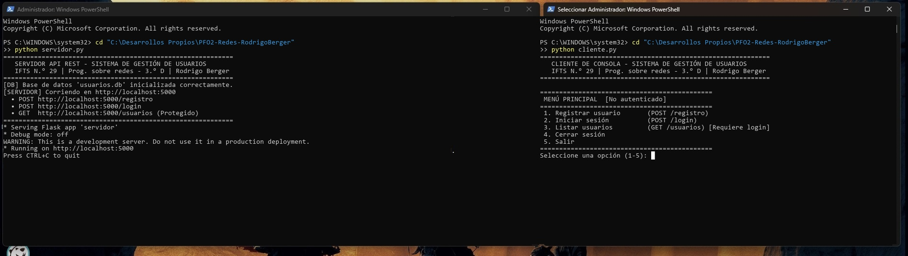
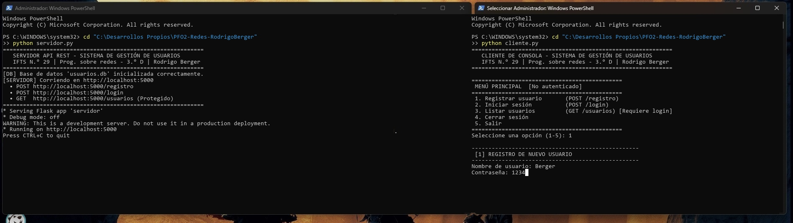
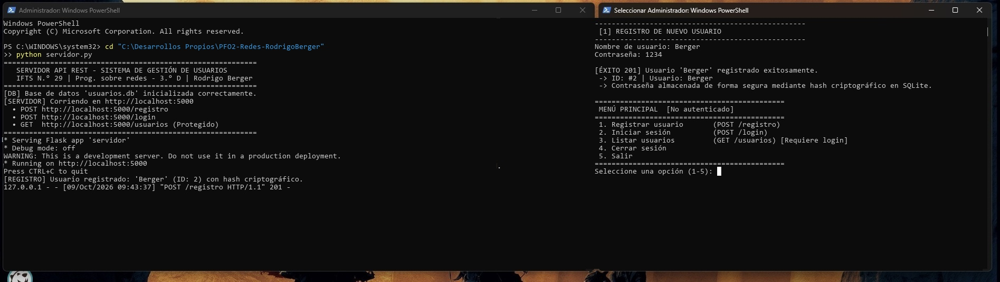
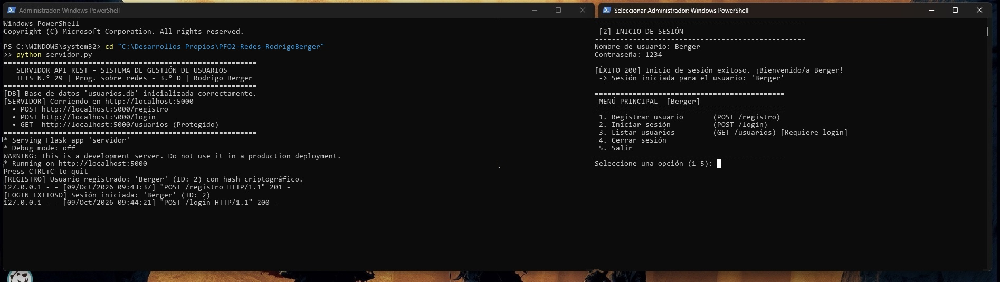
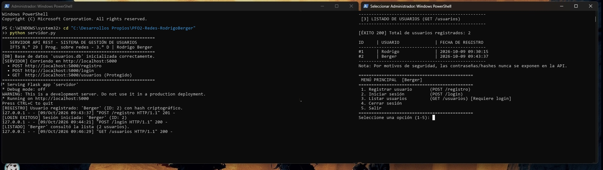
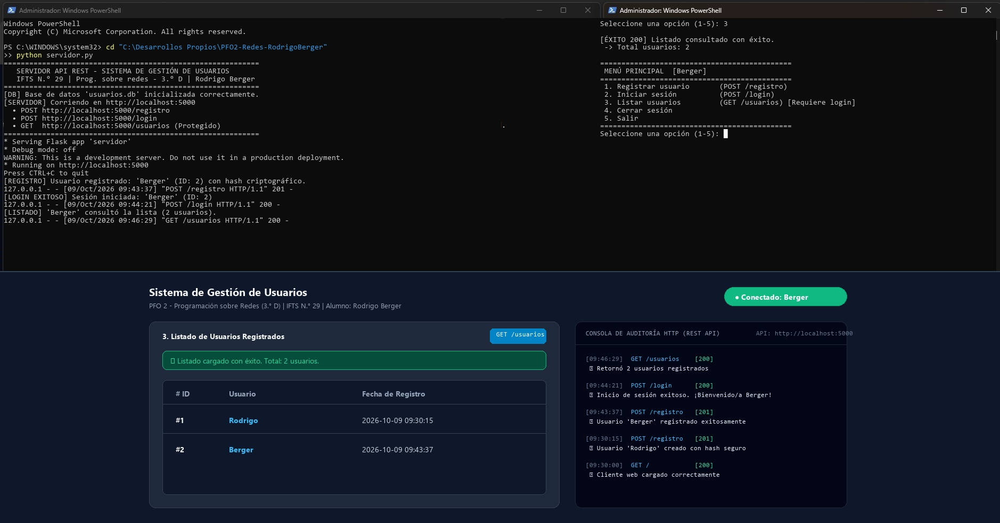

# PFO 2: Sistema de Gestión de Usuarios con API REST y Base de Datos

**Institución:** IFTS N.° 29  
**Materia:** Programación sobre redes - 3.° D  
**Alumno:** Rodrigo Berger  
**Tecnologías:** Python 3, Flask (API REST), SQLite3, Criptografía y Hashing (`werkzeug.security` - PBKDF2/scrypt), Cliente HTTP (`requests`), HTML5/CSS/JavaScript.

---

## 📌 1. Descripción del Proyecto

Este trabajo práctico implementa una arquitectura **Cliente-Servidor** basada en una **API REST** desarrollada con **Flask** y respaldada por persistencia en una base de datos relacional **SQLite** (`usuarios.db`).

El sistema implementa de forma limpia y directa los 3 requerimientos fundamentales:
1. **Crear usuario** con almacenamiento protegido mediante **hashing criptográfico unidireccional y salting** (nunca en texto plano).
2. **Iniciar sesión (Login)** validando credenciales contra el hash almacenado en la base de datos.
3. **Listado de usuarios**, protegido para usuarios con sesión iniciada (HTTP 401 Unauthorized si no está autenticado).

### Componentes:
- **`servidor.py`**: Servidor API REST en Flask que gestiona los endpoints de registro, login y listado de usuarios con base de datos SQLite.
- **`cliente.py`**: Cliente de consola con menú interactivo para consumir la API fácilmente.
- **`index.html`**: Cliente web interactivo con formularios de registro, login, tabla dinámica de usuarios y consola de peticiones HTTP en tiempo real.
- **`usuarios.db`**: Base de datos relacional SQLite con la tabla `usuarios`.

---

## 🗄️ 2. Estructura de la Base de Datos (SQLite)

La persistencia se realiza en `usuarios.db`:

### Tabla: `usuarios`
| Campo | Tipo | Restricciones | Descripción |
|---|---|---|---|
| `id` | `INTEGER` | `PRIMARY KEY AUTOINCREMENT` | Identificador único del usuario |
| `usuario` | `TEXT` | `UNIQUE NOT NULL` | Nombre de usuario |
| `contrasena_hash` | `TEXT` | `NOT NULL` | Hash seguro generado con salt (PBKDF2/scrypt) |
| `fecha_registro` | `TEXT` | `NOT NULL` | Fecha y hora del registro |

---

## 🌐 3. Especificación de Endpoints

### 1. Registro de Usuarios: `POST /registro`
Da de alta un usuario y almacena la contraseña hasheada en SQLite.
- **Body (JSON):**
  ```json
  {
    "usuario": "nombre",
    "contraseña": "1234"
  }
  ```
- **Respuestas:**
  - `201 Created`: Usuario registrado con éxito.
  - `400 Bad Request`: Datos incompletos.
  - `409 Conflict`: El nombre de usuario ya existe.

### 2. Inicio de Sesión: `POST /login`
Comprueba credenciales contra el hash en base de datos y habilita el acceso.
- **Body (JSON):**
  ```json
  {
    "usuario": "nombre",
    "contraseña": "1234"
  }
  ```
- **Respuestas:**
  - `200 OK`: Inicio de sesión exitoso.
  - `401 Unauthorized`: Usuario o contraseña incorrectos.

### 3. Listado de Usuarios: `GET /usuarios` *(Requiere Sesión Iniciada)*
Retorna el listado de todos los usuarios registrados. Por seguridad, no incluye contraseñas ni hashes.
- **Cabeceras de autenticación requeridas:** `X-Usuario` y `X-Contrasena` (o HTTP Basic Auth).
- **Respuestas:**
  - `200 OK`: Retorna el listado JSON de usuarios (`id`, `usuario`, `fecha_registro`).
  - `401 Unauthorized`: Si se intenta acceder sin haber iniciado sesión.

---

## 🧠 4. Respuestas Conceptuales

### 1. ¿Por qué hashear contraseñas?

Almacenar contraseñas en texto plano representa un fallo crítico de seguridad. Los motivos técnicos esenciales para utilizar funciones hash son:

1. **Protección ante Fugas de Datos (Data Breaches):**  
   Si la base de datos es extraída indebidamente por un atacante o se filtra una copia de seguridad, el atacante solo obtiene cadenas de hashes ininteligibles, impidiendo el acceso a las contraseñas reales de los usuarios.

2. **Propiedad Unidireccional (One-Way):**  
   A diferencia del cifrado simétrico/asimétrico (que es reversible mediante claves), una función hash criptográfica es **matemáticamente irreversible**. Es directo calcular `Hash = H(contraseña)`, pero es computacionalmente inviable deducir la contraseña original a partir del hash (`H⁻¹(Hash)`). Para autenticar, el servidor calcula el hash del texto ingresado en el login y lo compara con el almacenado, sin necesidad de conocer la clave en texto plano.

3. **Defensa contra Tablas de Arcoíris (Rainbow Tables) mediante Salting:**  
   Algoritmos modernos (como scrypt o PBKDF2 empleados por `werkzeug.security`) generan automáticamente un **Salt** (secuencia aleatoria única por usuario) que se combina con la contraseña antes de procesarla. Esto asegura que dos usuarios con la misma clave (ej: `"1234"`) tengan hashes totalmente distintos, inutilizando ataques basados en diccionarios precalculados.

4. **Resistencia a Fuerza Bruta:**  
   Los algoritmos específicos para contraseñas aplican deliberadamente costos computacionales y de memoria para ralentizar ataques automatizados de prueba y error masivos.

---

### 2. Ventajas de usar SQLite en este proyecto

Para el contexto y alcance de este proyecto, SQLite aporta ventajas clave:

1. **Arquitectura sin Servidor (Serverless):**  
   A diferencia de motores como MySQL o PostgreSQL, SQLite no requiere un servicio o proceso demonio corriendo en segundo plano ni apertura de puertos de red. La biblioteca interactúa directamente con el archivo en disco.

2. **Cero Configuración (Zero-Configuration):**  
   No requiere credenciales de red, administración de permisos ni cadenas complejas de conexión. Viene integrado de forma nativa en la biblioteca estándar de Python (`import sqlite3`).

3. **Portabilidad y Simplicidad de Entrega:**  
   Toda la base de datos se almacena en un único archivo autocontenido (`usuarios.db`). Esto facilita su entrega, respaldo y ejecución en cualquier equipo sin instalar infraestructura adicional.

4. **Garantía ACID:**  
   Cumple estrictamente con las propiedades de Atomicidad, Consistencia, Aislamiento y Durabilidad (**ACID**), protegiendo la integridad de los datos ante apagados abruptos o errores.

5. **Eficiencia y Bajo Consumo de Recursos:**  
   Tiene un consumo despreciable de memoria y CPU, haciéndolo ideal para desarrollos locales, pruebas y arquitecturas ligeras con Flask.

---

## 🚀 5. Guía de Ejecución

### Requisitos
Instalar dependencias necesarias:
```bash
pip install flask requests werkzeug
```

### Paso 1: Iniciar el Servidor API
En una terminal:
```bash
python servidor.py
```
El servidor quedará a la escucha en `http://localhost:5000`.

### Paso 2: Opciones de Cliente

#### Opción A: Cliente de Consola
En otra terminal distinta:
```bash
python cliente.py
```
Sigue el menú interactivo para:
1. Registrar un usuario.
2. Iniciar sesión.
3. Listar usuarios (comprobando el acceso protegido).

#### Opción B: Cliente Web
Abrir en el navegador web el archivo `index.html` o ingresar directamente a:
```
http://localhost:5000
```
Permite probar interactivamente el registro, login y visualización de la lista de usuarios con log HTTP en vivo.

### 👤 Usuarios y Credenciales de Prueba Iniciales

Para probar el inicio de sesión y el listado de inmediato, la base de datos se inicializa con:

| Usuario | Contraseña |
|---|---|
| `Rodrigo` | `1234` |
| `Berger` | `1234` |

---

## 📸 6. Capturas de Pantalla de Pruebas Exitosas

### 1. Inicialización del Servidor y Cliente
Puesta en marcha del servidor API Flask en `http://localhost:5000` con la base de datos `usuarios.db` inicializada, junto al menú interactivo de `cliente.py` indicando la institución **IFTS N.° 29**.


### 2. Formulario de Registro de Usuario
Selección de la Opción 1 en el cliente de consola e ingreso de credenciales para dar de alta un nuevo usuario (`Berger`, `1234`).


### 3. Registro Exitoso (`POST /registro` 201 Created)
Confirmación del alta en el cliente y verificación en el log del servidor indicando el almacenamiento seguro mediante hash criptográfico con salt en SQLite.


### 4. Inicio de Sesión (`POST /login` 200 OK)
Verificación de credenciales contra el hash en base de datos SQLite y actualización del estado de sesión activa a `[Berger]`.


### 5. Listado Protegido de Usuarios (`GET /usuarios` 200 OK)
Petición al endpoint protegido `GET /usuarios` enviando las credenciales de sesión activa, visualizando la lista de usuarios registrados sin exponer datos sensibles.


### 6. Flujo Completo y Cliente Web Interactivo
Ejecución integral visualizando las peticiones en vivo en las terminales y la interacción simultánea en el cliente web (`index.html`) con tabla dinámica y consola de auditoría HTTP en tiempo real.


---

## 🌐 7. Enlaces del Proyecto

- **Repositorio en GitHub:**  
  [https://github.com/rdbergeruser-stack/PFO2-Redes-RodrigoBerger](https://github.com/rdbergeruser-stack/PFO2-Redes-RodrigoBerger)

- **Sitio publicado en GitHub Pages:**  
  [https://rdbergeruser-stack.github.io/PFO2-Redes-RodrigoBerger/](https://rdbergeruser-stack.github.io/PFO2-Redes-RodrigoBerger/)
